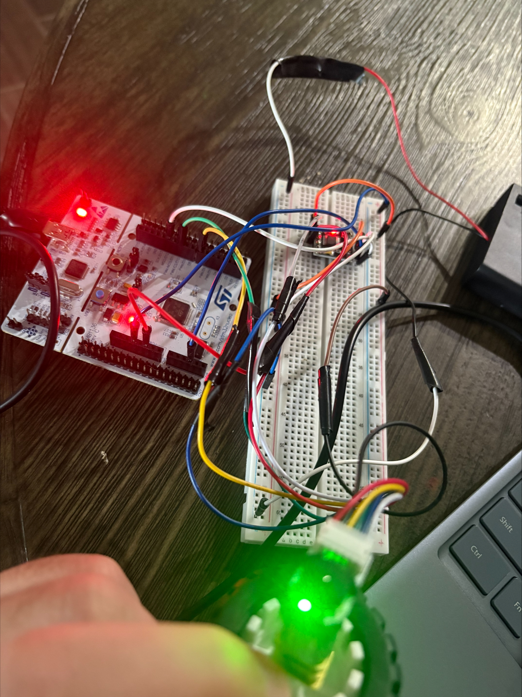
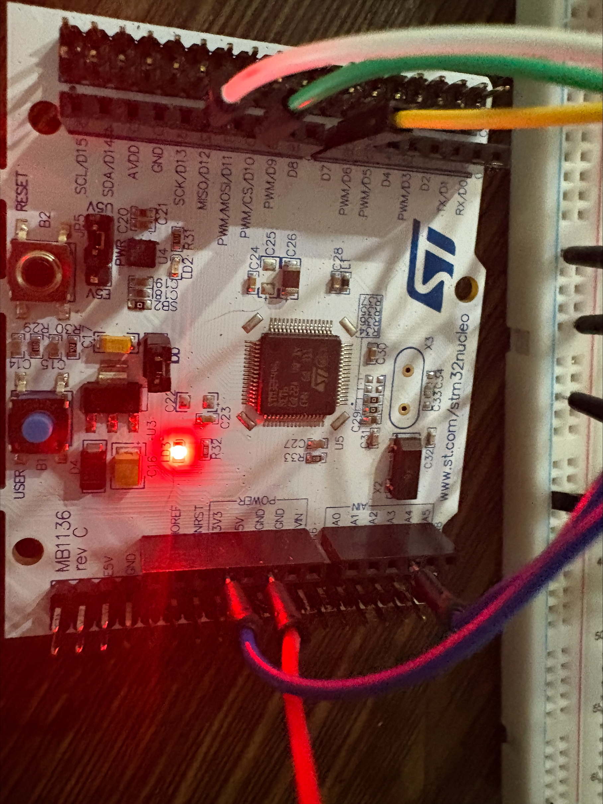
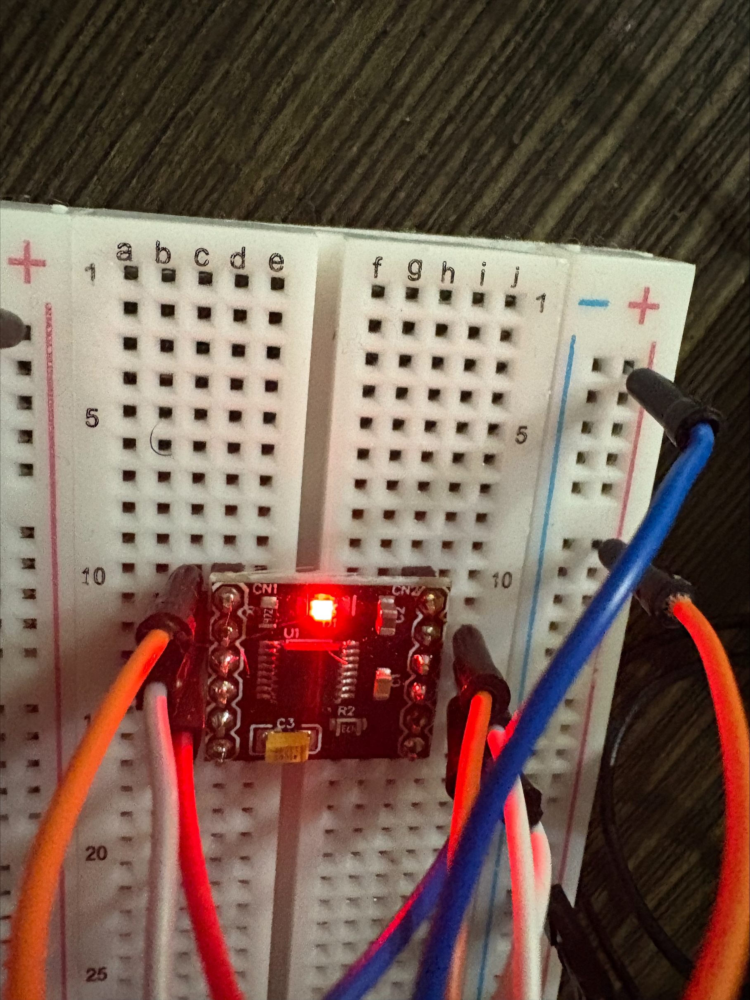

# stm32-pid-motor-controller

Bare metal STM32F446RE closed-loop DC motor controller using PID feedback, a quadrature encoder, a DRV8833 H-bridge, and FreeRTOS — no HAL libraries.

This project implements a full closed-loop speed controller for a brushed DC gear motor entirely from register-level code. All peripheral drivers (GPIO, TIM, EXTI, USART, NVIC) are written from scratch against the STM32F446RE reference manual. FreeRTOS handles task scheduling, inter-task communication, and timing for the control loop.

## Demo Video

[Watch the demo](https://youtube.com/shorts/UwDEEWiA-Pc)

The video shows:
- `SET 300` — motor ramps up to 300 RPM and settles at steady state
- A load disturbance applied by hand, and the controller recovering
- `STOP` — motor stops cleanly
- `SET -300` — reverse direction, same behavior as forward

## Setup Photos

**Full setup** — battery pack, breadboard, STM32, and motor:



**STM32 Nucleo board:**



**STM32 and breadboard wiring:**


**DRV8833 breadboard connections:**



## Hardware

| Component | Notes |
|---|---|
| Nucleo-F446RE (STM32F446RE) | Main MCU, programmed bare metal |
| N20 6V 500RPM DC gear motor with quadrature encoder | 30:1 gearbox, Hall effect encoder |
| DRV8833 dual H-bridge motor driver | Drives the motor, both channels used for PWM |
| External battery pack | Motor supply voltage (VM on DRV8833) |
| Jumper wires, breadboard | |

## Wiring / Pin Mapping

All grounds (Nucleo GND, DRV8833 GND, motor encoder GND, battery negative) are tied together on a common ground rail.

| Signal | Nucleo Pin | Connects To | Notes |
|---|---|---|---|
| Motor PWM (forward) | PA6 (TIM3_CH1, AF2) | DRV8833 AIN1 | PWM output, 1kHz |
| Motor PWM (reverse) | PB0 (TIM3_CH3, AF2) | DRV8833 AIN2 | PWM output, 1kHz |
| Encoder Channel A | PB6 | Motor encoder C1 | Floating input, EXTI6 |
| Encoder Channel B | PA8 | Motor encoder C2 | Floating input, EXTI8 |
| UART TX | PA2 (AF7) | ST-Link virtual COM port | 115200 baud |
| UART RX | PA3 (AF7) | ST-Link virtual COM port | 115200 baud |
| Encoder VCC | 3.3V | Motor encoder VCC | |
| DRV8833 VCC (logic) | 3.3V | DRV8833 VCC | |
| DRV8833 VM (motor supply) | Battery + | DRV8833 VM | External motor power |
| Common Ground | GND | DRV8833 GND, motor encoder GND, battery − | All grounds tied together |
| Motor leads | — | DRV8833 AOUT1 / AOUT2 | Motor power output from H-bridge |

Both DRV8833 inputs (AIN1/AIN2) are driven with PWM instead of one PWM + one GPIO direction pin. This was a deliberate fix for an issue where the DRV8833's brake mode created a non-linear, asymmetric PWM-to-RPM response in reverse. Driving both channels with PWM and zeroing the unused one makes forward and reverse behavior symmetric.

## Architecture

FreeRTOS tasks:

- **PID_Task** (priority 4) — runs every 100ms. Processes `SET`/`STOP` commands, ramps the target RPM at 30 RPM per cycle, runs the PID update, and writes the output to the motor via PWM.
- **UART_RX_Task** (priority 3) — reads incoming UART bytes from a queue, buffers a line, and parses commands.
- **Monitor_Task** (priority 2) — every 200ms, prints `TGT / ACT / PWM / ERR` over UART for live telemetry.

Communication between the UART receive interrupt, the command parser, and the PID loop is handled through FreeRTOS queues and a mutex-protected UART output.

## Commands

Send these over the serial terminal (115200 baud, 8N1):

| Command | Effect |
|---|---|
| `SET <rpm>` | Sets target speed in RPM. Positive = forward, negative = reverse (e.g. `SET 300`, `SET -300`) |
| `STOP` | Stops the motor and resets the controller state |

## PID Tuning

Final tuned gains:

```c
PID_init(&pid, 3.5f, 0.7f, 0.05f);
pid.integral_max = 350.0f;
#define PID_PERIOD_MS 100
```

Gains were tuned methodically using a step-by-step process: Kp was increased until the system reached a stable oscillation point (critical gain), then reduced to a stable working value. Ki was then added incrementally to drive steady-state error to zero. Kd was added last to damp overshoot after load disturbances. `integral_max` was tuned last to balance steady-state accuracy against windup during hard stalls.

## Performance

- **Startup:** from a stop, the motor takes roughly 10-15 seconds to converge to `ERR:0` at the target RPM. This is dominated by motor/gearbox mechanical behavior at low speed (brush cogging), not the control loop — the PID output is smooth and non-oscillatory throughout.
- **Load disturbance recovery:** when a load is applied and then released, the controller returns to `ERR:0` in roughly 1-2 seconds, often faster. Under moderate sustained load, the motor holds approximately 90% of target RPM with the PID actively increasing PWM to compensate.
- **Hard stall recovery:** if the motor is fully stalled (PWM saturates at 999), releasing the load results in recovery to target within well under a second.
- **Reverse direction:** behaves symmetrically to forward — same convergence behavior, same recovery characteristics, thanks to the dual-PWM H-bridge drive.

## Known Limitations

- **Slow startup from a dead stop** is a hardware limitation of the N20 motor/gearbox (brush cogging at low speed), not a controller limitation. The control loop itself shows no oscillation or instability during startup.
- **Run-to-run startup variance** — because of brush contact position at rest, startup time varies by a few seconds between runs even with identical gains.
- `TIM_PWM_init()` hardcodes the TIM3 peripheral clock enable bit regardless of the timer pointer passed in. It currently only works correctly when called with `TIM3`.
- `DIR F` / `DIR R` style direction commands are not implemented — direction is controlled entirely by the sign of the `SET <rpm>` argument.

## Build Instructions

This is an STM32CubeIDE project with FreeRTOS added manually (not via CubeMX).

1. Clone the repository.
2. Open STM32CubeIDE and import the project (File → Open Projects from File System).
3. Ensure the FreeRTOS source (under `FreeRTOS/`) is included in the build path — it's part of the repo.
4. Build (Project → Build Project).
5. Flash to a Nucleo-F446RE via the onboard ST-Link (Run → Debug, or use the Run button).
6. Open a serial terminal at 115200 baud, 8N1, on the ST-Link virtual COM port.
7. Send commands as described above.

## Code Structure

```
Inc/        — header files (peripheral register maps, driver APIs, Doxygen documentation)
Src/        — driver and application source files
FreeRTOS/   — FreeRTOS kernel source (manually added)
```

All peripheral drivers (`gpio`, `tim`, `exti`, `uart`, `nvic`, `encoder`, `motor`) are written against the STM32F446RE reference manual (RM0390) at the register level — no ST HAL or LL libraries are used.
